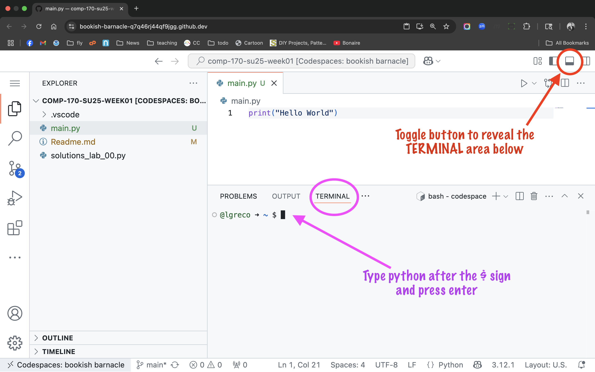

# COMP 170 SU25 WEEK 01

## Solutions to lab 00

See file [`solutions_lab_00.py`](./solutions_lab_00.py)

## Reading assignment

Reading assignment is based on the course's textbook; while I do not require the book, if you continue in the CS major other instructors will require it. The second column in the table below provides links to an online book, matching the textbook topics. The online book is available at no cost to you when you access O'Reilly Learning using your LUC email address.

The textbook uses `IDLE` an interactive Python applicationf for its examples. An easier alternative to `IDLE` is available on your GitHub Codespace. See the note at the end of this page for 

| Textbook             | [Bill Lubanovic's book](https://shorturl.at/bO1CC)                 |
|----------------------|--------------------------------------------------------------------|
| Chapter 1            | [Chapter 1](https://shorturl.at/sbxNc)                             |
| Chapter 2.1          | [Chapter 2](https://shorturl.at/HLt0v)                             |
| Chapter 2.2          | [Chapter 3](https://shorturl.at/E1GaN)                             |
| Chapter 4.1          | [Chapter 6](https://shorturl.at/WcT64) (if part only)              |
| Chapter 4.4          | [Chapter 4](https://learning.oreilly.com/library/view/introducing-python-3rd/9781098174392/ch04.html) (up to "Combine with +" section)|
| Chapter 5.3          |(covered across the chapters)                               |

# No homework due next week

Instead please complete the reading assigment above. There will be brief 1-2 minute pop quizzes in-class throughout next week to assess your review of the material listed above.

 

## Preview of material for next week

In week 02 week we'll cover the following topics from the book.

| Textbook             | [Bill Lubanovic's book](https://shorturl.at/bO1CC)                 |
|----------------------|--------------------------------------------------------------------|
| Chapter 2.3          | [Chapter 7](https://learning.oreilly.com/library/view/introducing-python-3rd/9781098174392/ch07.html) |
| Chapter 2.4          | - |
| Chapter 3.1          | [Part of Chapter 10](https://learning.oreilly.com/library/view/introducing-python-3rd/9781098174392/ch10.html#c10_h_arguments) |
| Chapter 4.3          | - |
| Chapter 7.1          | [Lists from chapter 8](https://learning.oreilly.com/library/view/introducing-python-3rd/9781098174392/ch08.html#c08_h_list_create) |
| Chapter 7.2          | - |
| Chapter 8.1          | [Dictionaries from chapter 9](https://learning.oreilly.com/library/view/introducing-python-3rd/9781098174392/ch09.html#c09_h_dictionaries) |

# Alternative to `IDLE`

For an interactive Python environment look no further than your GitHub Codespace. Launch CodeSpaces, and go to the lower half of the window, the terminal. Type `python` next to the dollar sign and press enter. This will get you to the interactive Python environment. When you are done, type `exit()` and press enter. Or, simply, close the browser tab with the Codespace.

If you do not see the TERMINAL area in Codespaces, click on the toggle button shown in the screenshot below.

